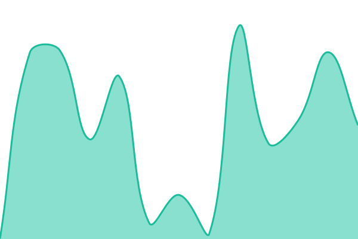
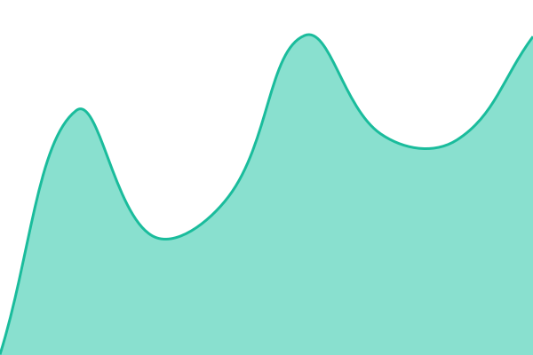

# [📈 Live Status]

<!--live status--> **🟩 All systems operational**

This repository contains the open-source uptime monitor and status page for [TheRealGeoYT]

<!--start: status pages-->
<!-- This summary is generated by Upptime (https://github.com/upptime/upptime) -->
<!-- Do not edit this manually, your changes will be overwritten -->
<!-- prettier-ignore -->
| URL | Status | History | Response Time | Uptime |
| --- | ------ | ------- | ------------- | ------ |
|  [Portfolio](https://therealgeo.de) | 🟩 Up | [portfolio.yml](https://github.com/TheRealGeoYT/status/commits/HEAD/history/portfolio.yml) | 

 363ms
     
 | 

<a href="https://demo.upptime.js.org/history/portfolio">99.48%</a>
    

|  [Sonstige Dienste](https://status.therealgeo.de) | 🟩 Up | [sonstige-dienste.yml](https://github.com/TheRealGeoYT/status/commits/HEAD/history/sonstige-dienste.yml) | 

 484ms
     
 | 

<a href="https://demo.upptime.js.org/history/sonstige-dienste">100.00%</a>
    

<!--end: status pages-->undefined
